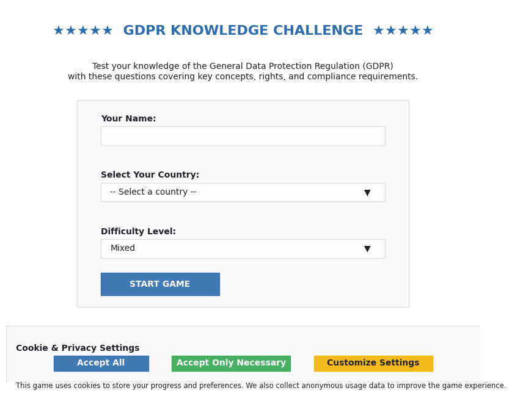
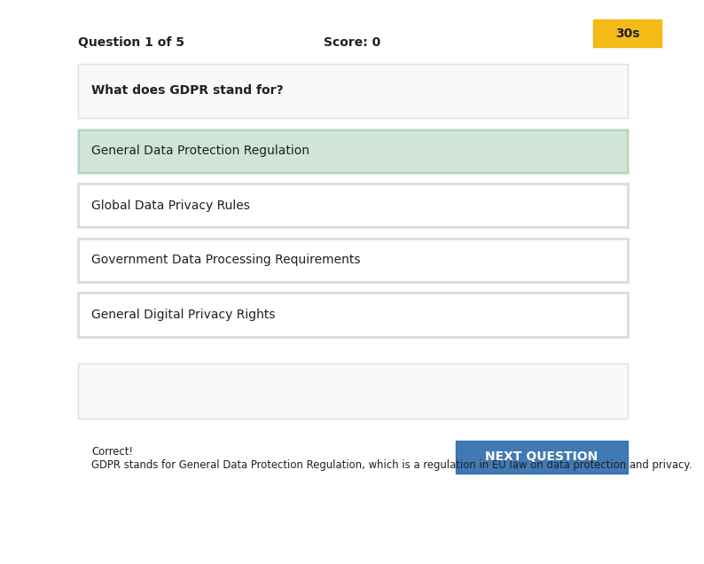
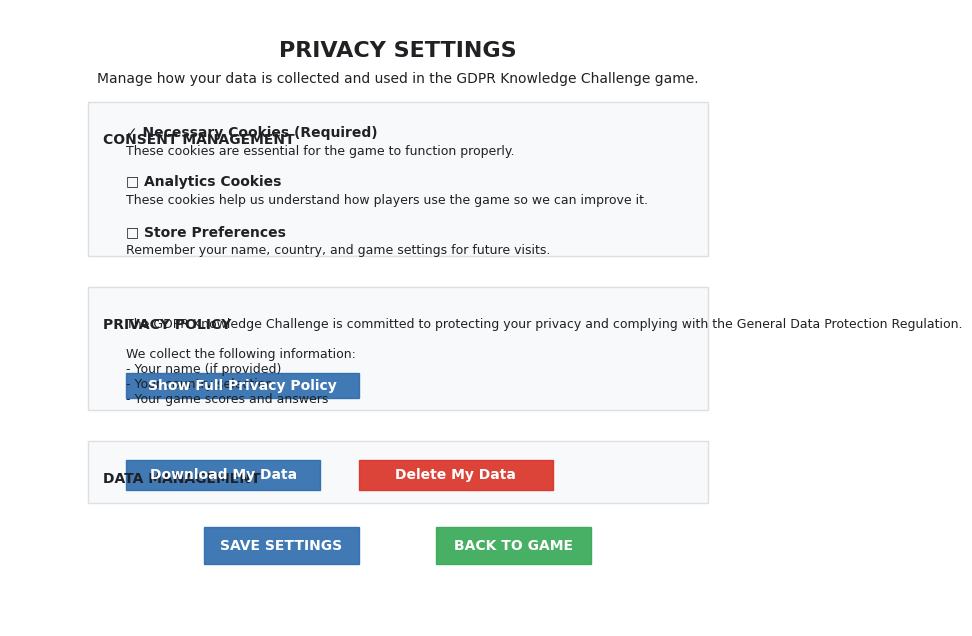

# GDPR Educational Game Mockups

This document provides detailed descriptions and visual representations of the main game screens and UI components for the GDPR educational game.

## Color Scheme

Based on the existing CSS and EU themes:

- **Primary Color**: #2c6bac (EU Blue)
- **Secondary Color**: #34a853 (Green)
- **Accent Color**: #f5b400 (Yellow/Gold)
- **Error Color**: #d93025 (Red)
- **Success Color**: #188038 (Dark Green)
- **Background Light**: #ffffff (White)
- **Background Off**: #f8f9fa (Light Gray)
- **Text Dark**: #202124 (Near Black)

## Typography

- **Font Family**: System fonts stack (Segoe UI, Roboto, etc.)
- **Base Font Size**: 16px
- **Headings**: Bold, with larger sizes for hierarchy

## 1. Welcome/Country Selection Screen

### Layout Description

A clean, welcoming interface that introduces the game and collects initial player information. The screen features a prominent game title, brief introduction, and a form for player details.

### Key UI Elements

- **Header**: Large game title "GDPR Knowledge Challenge" with EU-themed styling
- **Introduction Text**: Brief explanation of the game's purpose
- **Player Form**:
  - Name input field
  - Country selection dropdown (30 EU nations + non-EU option)
  - Difficulty level selector (Easy, Medium, Hard, Mixed)
- **Start Button**: Prominent call-to-action
- **GDPR Consent Banner**: Fixed at bottom of screen

### User Interaction Flow

1. User arrives at welcome screen
2. GDPR consent banner appears (if consent not previously given)
3. User enters name
4. User selects country from dropdown
5. User selects difficulty level
6. User clicks "Start Game" button
7. Game transitions to quiz interface

### Responsive Design Considerations

- **Desktop**: Two-column layout with introduction on left, form on right
- **Tablet**: Single column with form below introduction
- **Mobile**: Compact single column, stacked elements with optimized spacing

### Visual Representation



```
┌─────────────────────────────────────────────────────────────┐
│                                                             │
│  ★★★★★  GDPR KNOWLEDGE CHALLENGE  ★★★★★                     │
│                                                             │
│  Test your knowledge of the General Data Protection         │
│  Regulation (GDPR) with these questions covering key        │
│  concepts, rights, and compliance requirements.             │
│                                                             │
│  ┌─────────────────────────────────────────────────────┐    │
│  │                                                     │    │
│  │  Your Name:                                         │    │
│  │  ┌─────────────────────────────────────────────┐    │    │
│  │  │                                             │    │    │
│  │  └─────────────────────────────────────────────┘    │    │
│  │                                                     │    │
│  │  Select Your Country:                               │    │
│  │  ┌─────────────────────────────────────────────┐    │    │
│  │  │ -- Select a country --                  ▼   │    │    │
│  │  └─────────────────────────────────────────────┘    │    │
│  │                                                     │    │
│  │  Difficulty Level:                                  │    │
│  │  ┌─────────────────────────────────────────────┐    │    │
│  │  │ Mixed                                   ▼   │    │    │
│  │  └─────────────────────────────────────────────┘    │    │
│  │                                                     │    │
│  │  ┌─────────────────────────┐                        │    │
│  │  │      START GAME         │                        │    │
│  │  └─────────────────────────┘                        │    │
│  │                                                     │    │
│  └─────────────────────────────────────────────────────┘    │
│                                                             │
└─────────────────────────────────────────────────────────────┘

┌─────────────────────────────────────────────────────────────┐
│                  Cookie & Privacy Settings                  │
│ This game uses cookies to store your progress and           │
│ preferences. We also collect anonymous usage data to        │
│ improve the game experience.                                │
│                                                             │
│ [Accept All]  [Accept Only Necessary]  [Customize Settings] │
└─────────────────────────────────────────────────────────────┘
```

## 2. Quiz Interface

### Layout Description

A focused interface that presents one question at a time with multiple-choice answers. The screen includes progress tracking, score display, and a timer to create a sense of challenge.

### Key UI Elements

- **Quiz Header**:
  - Progress indicator (e.g., "Question 1 of 5")
  - Current score
  - Timer countdown
- **Question Container**:
  - Question text
  - Multiple-choice options (4 options per question)
- **Feedback Area**: Shows explanation after answering
- **Navigation**: "Next Question" button (enabled after answering)

### User Interaction Flow

1. User reads the question
2. Timer counts down from 30 seconds
3. User selects an answer option
4. Selection is highlighted and feedback is shown
5. "Next Question" button becomes enabled
6. User clicks "Next Question" to proceed
7. Process repeats until all questions are answered

### Responsive Design Considerations

- **Desktop**: Spacious layout with large answer options
- **Tablet**: Slightly condensed layout with full-width answer options
- **Mobile**: Stacked layout with optimized touch targets for answer options

### Visual Representation

#### Before Answering


```
┌─────────────────────────────────────────────────────────────┐
│                                                             │
│  Question 1 of 5       Score: 0       ┌─────┐               │
│                                       │ 30s │               │
│                                       └─────┘               │
│  ┌─────────────────────────────────────────────────────┐    │
│  │                                                     │    │
│  │  What does GDPR stand for?                          │    │
│  │                                                     │    │
│  └─────────────────────────────────────────────────────┘    │
│                                                             │
│  ┌─────────────────────────────────────────────────────┐    │
│  │  General Data Protection Regulation                 │    │
│  └─────────────────────────────────────────────────────┘    │
│                                                             │
│  ┌─────────────────────────────────────────────────────┐    │
│  │  Global Data Privacy Rules                          │    │
│  └─────────────────────────────────────────────────────┘    │
│                                                             │
│  ┌─────────────────────────────────────────────────────┐    │
│  │  Government Data Processing Requirements            │    │
│  └─────────────────────────────────────────────────────┘    │
│                                                             │
│  ┌─────────────────────────────────────────────────────┐    │
│  │  General Digital Privacy Rights                     │    │
│  └─────────────────────────────────────────────────────┘    │
│                                                             │
│  ┌─────────────────────────────────────────────────────┐    │
│  │                                                     │    │
│  │                                                     │    │
│  │                                                     │    │
│  └─────────────────────────────────────────────────────┘    │
│                                                             │
│                                  ┌─────────────────────┐    │
│                                  │   NEXT QUESTION    │    │
│                                  └─────────────────────┘    │
│                                                             │
└─────────────────────────────────────────────────────────────┘
```

#### After Selecting an Answer


```
┌─────────────────────────────────────────────────────────────┐
│                                                             │
│  Question 1 of 5       Score: 1       ┌─────┐               │
│                                       │ 23s │               │
│                                       └─────┘               │
│  ┌─────────────────────────────────────────────────────┐    │
│  │                                                     │    │
│  │  What does GDPR stand for?                          │    │
│  │                                                     │    │
│  └─────────────────────────────────────────────────────┘    │
│                                                             │
│  ┌─────────────────────────────────────────────────────┐    │
│  │  General Data Protection Regulation                 │    │
│  └─────────────────────────────────────────────────────┘    │
│                                                             │
│  ┌─────────────────────────────────────────────────────┐    │
│  │  Global Data Privacy Rules                          │    │
│  └─────────────────────────────────────────────────────┘    │
│                                                             │
│  ┌─────────────────────────────────────────────────────┐    │
│  │  Government Data Processing Requirements            │    │
│  └─────────────────────────────────────────────────────┘    │
│                                                             │
│  ┌─────────────────────────────────────────────────────┐    │
│  │  General Digital Privacy Rights                     │    │
│  └─────────────────────────────────────────────────────┘    │
│                                                             │
│  ┌─────────────────────────────────────────────────────┐    │
│  │  Correct!                                           │    │
│  │  GDPR stands for General Data Protection            │    │
│  │  Regulation, which is a regulation in EU law on     │    │
│  │  data protection and privacy.                       │    │
│  └─────────────────────────────────────────────────────┘    │
│                                                             │
│                                  ┌─────────────────────┐    │
│                                  │   NEXT QUESTION    │    │
│                                  └─────────────────────┘    │
│                                                             │
└─────────────────────────────────────────────────────────────┘
```

## 3. Results and Rankings Display

### Layout Description

A celebratory screen that shows the player's performance and compares it to others. The screen features the final score, time taken, and leaderboards for EU and global players.

### Key UI Elements

- **Results Summary**:
  - Final score (e.g., "4 out of 5")
  - Time taken
  - Performance message
- **Leaderboards**:
  - EU leaderboard with chart visualization
  - Global leaderboard with chart visualization
  - Player rankings with country flags
- **Action Buttons**:
  - "Play Again" button
  - "Share Results" button

### User Interaction Flow

1. User completes the final question
2. Results screen appears with score summary
3. Leaderboards animate to show rankings
4. User's position is highlighted in the rankings
5. User can choose to play again or share results

### Responsive Design Considerations

- **Desktop**: Side-by-side leaderboards with charts
- **Tablet**: Leaderboards stacked but still showing charts
- **Mobile**: Compact leaderboards with simplified charts

### Visual Representation


```
┌─────────────────────────────────────────────────────────────┐
│                                                             │
│                     YOUR RESULTS                            │
│                                                             │
│  ┌─────────────────────────────────────────────────────┐    │
│  │                                                     │    │
│  │  Final Score: 4 out of 5                           │    │
│  │  Time Taken: 87 seconds                            │    │
│  │                                                     │    │
│  │  Great job! You have a strong understanding of GDPR.│    │
│  │                                                     │    │
│  └─────────────────────────────────────────────────────┘    │
│                                                             │
│  ┌───────────────────────────┐ ┌───────────────────────────┐│
│  │                           │ │                           ││
│  │      EU LEADERBOARD       │ │     GLOBAL LEADERBOARD    ││
│  │                           │ │                           ││
│  │  ┌───────────────────┐    │ │  ┌───────────────────┐    ││
│  │  │                   │    │ │  │                   │    ││
│  │  │                   │    │ │  │                   │    ││
│  │  │                   │    │ │  │                   │    ││
│  │  │                   │    │ │  │                   │    ││
│  │  │                   │    │ │  │                   │    ││
│  │  └───────────────────┘    │ │  └───────────────────┘    ││
│  │                           │ │                           ││
│  │  1. Maria (DE) - 5/5     │ │  1. John (US) - 5/5       ││
│  │  2. Jean (FR) - 5/5      │ │  2. Maria (DE) - 5/5      ││
│  │  3. YOU (IT) - 4/5       │ │  3. Jean (FR) - 5/5       ││
│  │  4. Hans (AT) - 3/5      │ │  4. YOU (IT) - 4/5        ││
│  │  5. Anna (SE) - 3/5      │ │  5. Hans (AT) - 3/5       ││
│  │                           │ │                           ││
│  └───────────────────────────┘ └───────────────────────────┘│
│                                                             │
│       ┌─────────────────┐        ┌─────────────────┐        │
│       │    PLAY AGAIN   │        │  SHARE RESULTS  │        │
│       └─────────────────┘        └─────────────────┘        │
│                                                             │
└─────────────────────────────────────────────────────────────┘
```

## 4. Privacy Settings Screen

### Layout Description

A transparent interface that allows users to manage their privacy preferences. The screen includes consent options, a privacy policy display, and data management controls.

### Key UI Elements

- **Privacy Header**: Clear title and introduction
- **Consent Options**:
  - Necessary cookies toggle (always required)
  - Analytics cookies toggle
  - Preferences storage toggle
- **Privacy Policy**: Scrollable text area with GDPR information
- **Data Management**:
  - "Download My Data" button
  - "Delete My Data" button
- **Action Buttons**:
  - "Save Settings" button
  - "Back to Game" button

### User Interaction Flow

1. User accesses privacy settings from main menu or footer
2. User reviews current consent settings
3. User toggles preferences as desired
4. User can read the full privacy policy
5. User can request data download or deletion
6. User saves settings or returns to game

### Responsive Design Considerations

- **Desktop**: Two-column layout with policy on right
- **Tablet**: Flexible layout with policy below settings
- **Mobile**: Single column with collapsible policy section

### Visual Representation



```
┌─────────────────────────────────────────────────────────────┐
│                                                             │
│                 PRIVACY SETTINGS                            │
│                                                             │
│  Manage how your data is collected and used in the GDPR     │
│  Knowledge Challenge game.                                  │
│                                                             │
│  ┌─────────────────────────────────────────────────────┐    │
│  │                                                     │    │
│  │  CONSENT MANAGEMENT                                 │    │
│  │                                                     │    │
│  │  [✓] Necessary Cookies (Required)                   │    │
│  │      These cookies are essential for the game to    │    │
│  │      function properly.                             │    │
│  │                                                     │    │
│  │  [ ] Analytics Cookies                              │    │
│  │      These cookies help us understand how players   │    │
│  │      use the game so we can improve it.             │    │
│  │                                                     │    │
│  │  [ ] Store Preferences                              │    │
│  │      Remember your name, country, and game settings │    │
│  │      for future visits.                             │    │
│  │                                                     │    │
│  └─────────────────────────────────────────────────────┘    │
│                                                             │
│  ┌─────────────────────────────────────────────────────┐    │
│  │                                                     │    │
│  │  PRIVACY POLICY                                     │    │
│  │                                                     │    │
│  │  The GDPR Knowledge Challenge is committed to       │    │
│  │  protecting your privacy and complying with the     │    │
│  │  General Data Protection Regulation.                │    │
│  │                                                     │    │
│  │  We collect the following information:              │    │
│  │  - Your name (if provided)                          │    │
│  │  - Your country selection                           │    │
│  │  - Your game scores and answers                     │    │
│  │                                                     │    │
│  │  [Show Full Privacy Policy]                         │    │
│  │                                                     │    │
│  └─────────────────────────────────────────────────────┘    │
│                                                             │
│  ┌─────────────────────────────────────────────────────┐    │
│  │                                                     │    │
│  │  DATA MANAGEMENT                                    │    │
│  │                                                     │    │
│  │  [Download My Data]     [Delete My Data]            │    │
│  │                                                     │    │
│  └─────────────────────────────────────────────────────┘    │
│                                                             │
│       ┌─────────────────┐        ┌─────────────────┐        │
│       │  SAVE SETTINGS  │        │   BACK TO GAME  │        │
│       └─────────────────┘        └─────────────────┘        │
│                                                             │
└─────────────────────────────────────────────────────────────┘
```

## Mobile Responsive Adaptations

### Welcome Screen (Mobile)

```
┌───────────────────────────┐
│                           │
│       ★★★  GDPR  ★★★      │
│   KNOWLEDGE CHALLENGE     │
│                           │
│  Test your knowledge of   │
│  the General Data         │
│  Protection Regulation    │
│                           │
│  Your Name:               │
│  ┌───────────────────┐    │
│  │                   │    │
│  └───────────────────┘    │
│                           │
│  Select Your Country:     │
│  ┌───────────────────┐    │
│  │ -- Select --  ▼   │    │
│  └───────────────────┘    │
│                           │
│  Difficulty Level:        │
│  ┌───────────────────┐    │
│  │ Mixed         ▼   │    │
│  └───────────────────┘    │
│                           │
│  ┌───────────────────┐    │
│  │    START GAME     │    │
│  └───────────────────┘    │
│                           │
└───────────────────────────┘

┌───────────────────────────┐
│  Cookie & Privacy         │
│                           │
│  [Accept All]             │
│  [Accept Only Necessary]  │
│  [Customize Settings]     │
└───────────────────────────┘
```

### Quiz Screen (Mobile)

```
┌───────────────────────────┐
│                           │
│  Q1/5    Score: 0   30s   │
│                           │
│  What does GDPR stand     │
│  for?                     │
│                           │
│  ┌───────────────────┐    │
│  │ General Data      │    │
│  │ Protection        │    │
│  │ Regulation        │    │
│  └───────────────────┘    │
│                           │
│  ┌───────────────────┐    │
│  │ Global Data       │    │
│  │ Privacy Rules     │    │
│  └───────────────────┘    │
│                           │
│  ┌───────────────────┐    │
│  │ Government Data   │    │
│  │ Processing        │    │
│  │ Requirements      │    │
│  └───────────────────┘    │
│                           │
│  ┌───────────────────┐    │
│  │ General Digital   │    │
│  │ Privacy Rights    │    │
│  └───────────────────┘    │
│                           │
│  ┌───────────────────┐    │
│  │  NEXT QUESTION    │    │
│  └───────────────────┘    │
│                           │
└───────────────────────────┘
```

## Implementation Recommendations

1. **Accessibility Considerations**:
   - Ensure sufficient color contrast (WCAG 2.1 AA compliance)
   - Provide keyboard navigation for all interactive elements
   - Include screen reader support with ARIA attributes
   - Support text scaling and zoom functionality

2. **Performance Optimization**:
   - Minimize animations on mobile devices
   - Use SVG for icons and UI elements where possible
   - Implement lazy loading for leaderboard data
   - Cache game questions for offline play

3. **Technical Implementation**:
   - Use CSS Grid and Flexbox for responsive layouts
   - Implement CSS variables for theming
   - Use JavaScript for interactive elements and game logic
   - Store game state in localStorage with proper consent

4. **User Experience Enhancements**:
   - Add subtle animations for transitions between screens
   - Include sound effects for correct/incorrect answers (with mute option)
   - Provide immediate feedback for user interactions
   - Implement progressive difficulty levels